# アプリアイコンのカスタマイズ方法

1. ## テーマリソースをファイルアプリにダウンロード

- アプリ内で「ダウンロード」をタップ

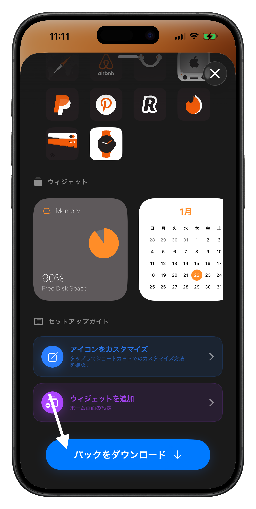

- ダウンロード完了後、共有ウィンドウが表示されるので「ファイルに保存」を選択

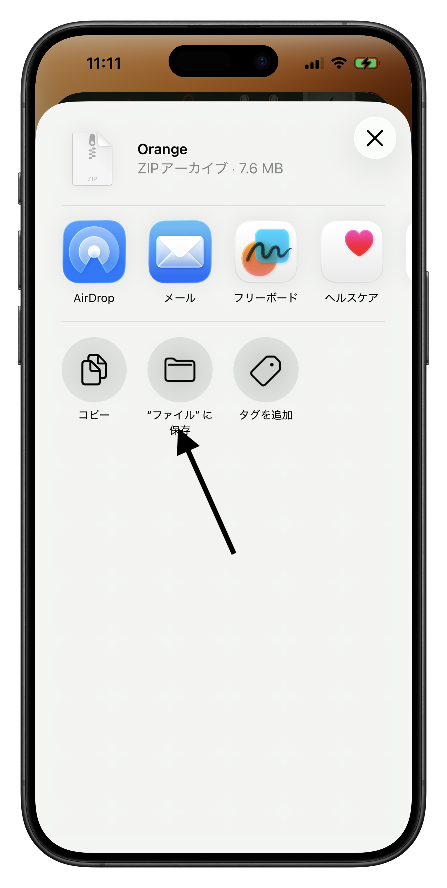

- ファイルアプリを開く

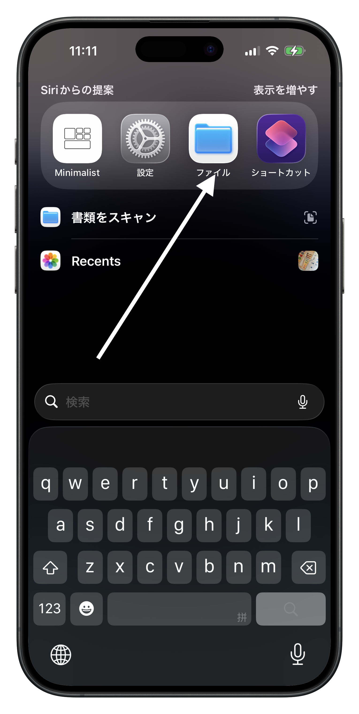

- 「最近」にダウンロードしたテーマファイルが表示されるので、タップして解凍

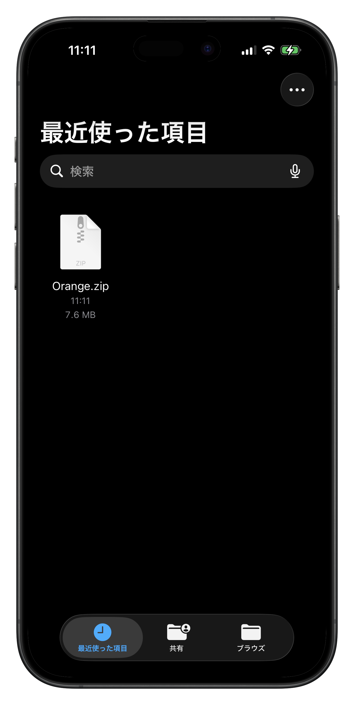

1. ## ショートカットでカスタムアイコンを設定

- ショートカットアプリを開く

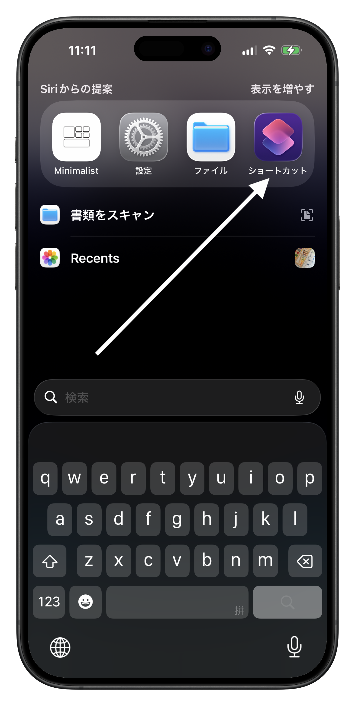

- 右上の➕をタップして新規ショートカット作成

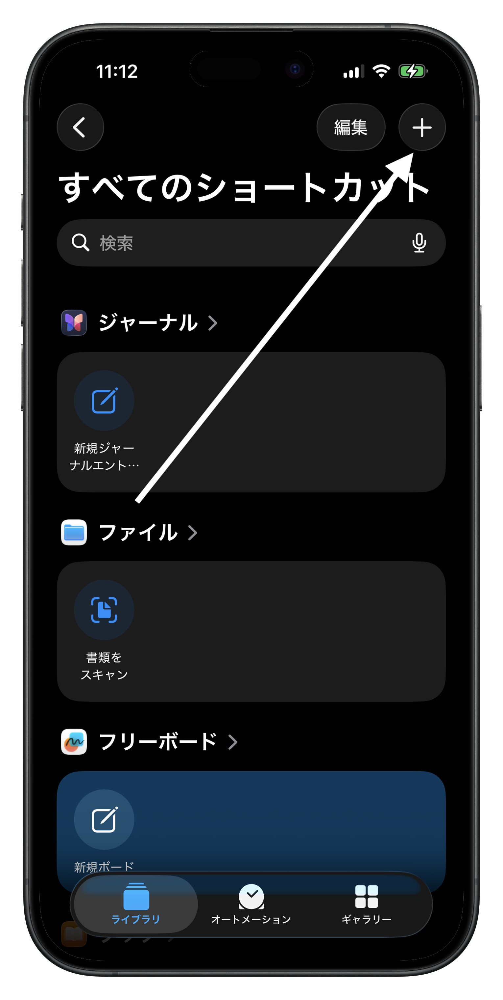

- 操作検索で「アプリを開く」を検索

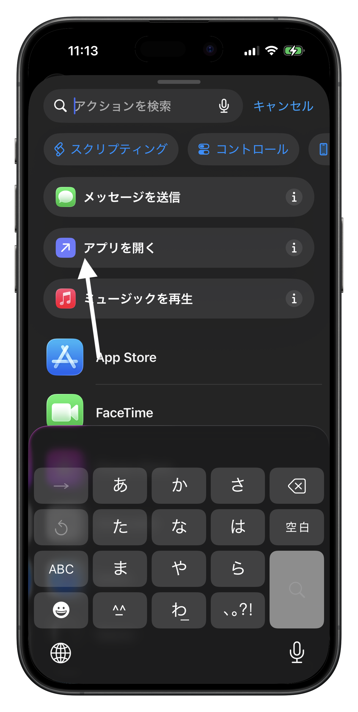

- 「App」を選択し、置き換えたいアプリを選ぶ

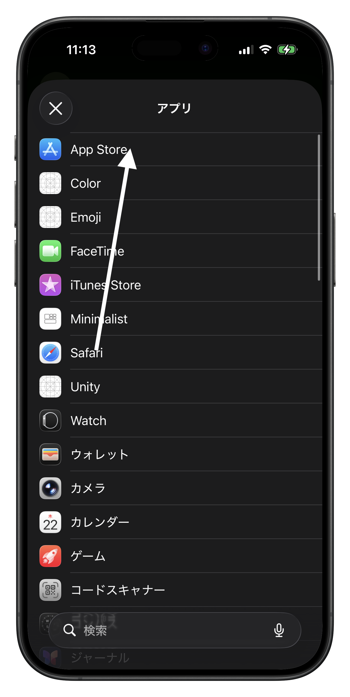

- 上部タイトルをタップし、対応するアプリ名にリネーム

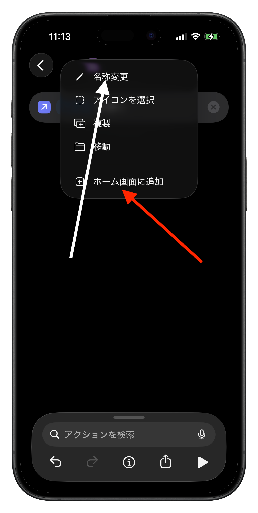

- 「ホーム画面に追加」を選択

1. ## ショートカットをホーム画面に追加

- 「画像を選択」をタップ，「ファイルを選択」を押す

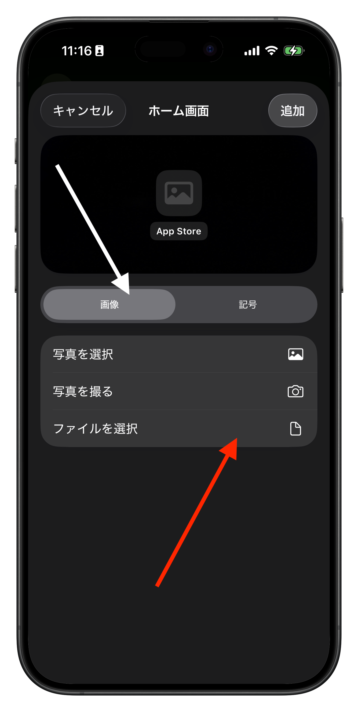

- 表示されたウィンドウから解凍したテーマフォルダを選択，「icons」フォルダ内から好みのアイコンを選択

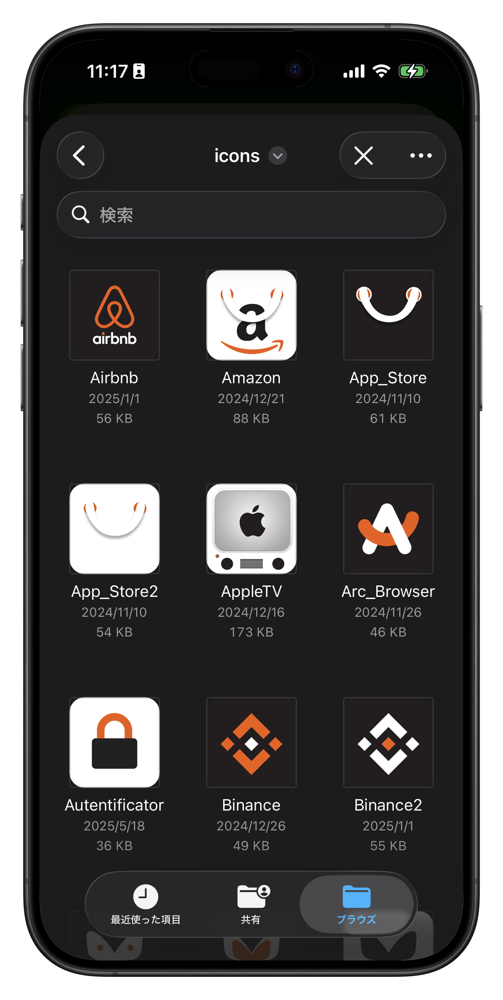

- 「追加」をタップで置き換え完了

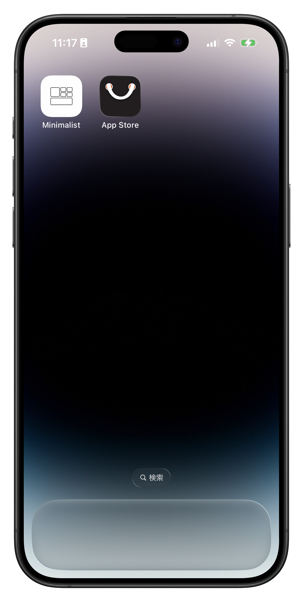